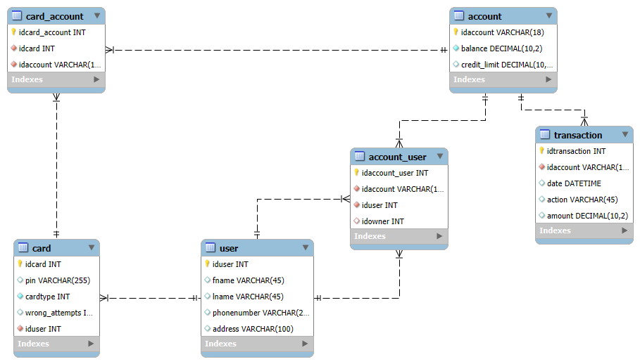
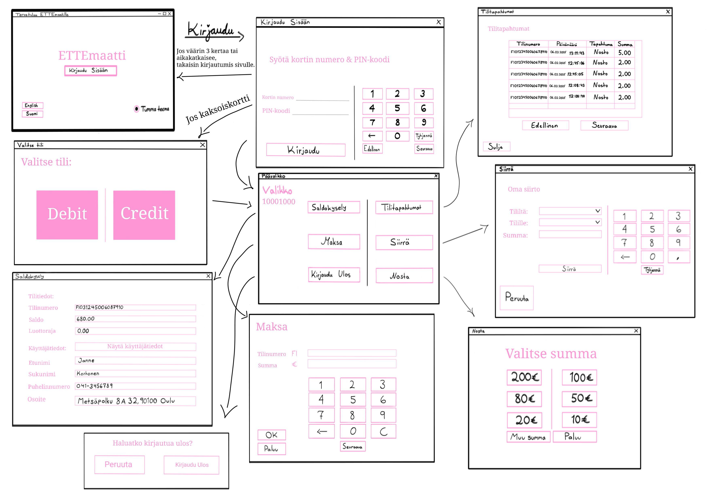

# ATM/Group_12

This project was a part of Software Development Application Project Course (IN00ED14-3003) for Oulu University of Applied Sciences, led by Pekka Alaluukas and Teemu Korpela. Group 12 consisted of Emma Takkinen, Erika Turtinen, Tero Asilainen and Terhi Wallin.

## Technologies Used

Project uses a MySQL database. After some thorough reflection and teacher's feedback, Entity Relationship Model became as such:

ER model

API was developed using Node.js/Express.js. Each student created all the CRUD-operations for their own database table.

Desktop application was created with QtCreator. Some plans for our software:

Concept flow map:

## Extra Functionalities:

- Dark/Light Mode
    -> User can choose to use a vibrant white and pink theme, or a more eye saving dark one.

- Language Selection
    -> Available languages are english and finnish.

- Money Transfer
    -> User can transfer money between their own accounts. Account selection with easy to use drop down menu.

- Payment
    -> User can create payments to their chosen account.

- Timer
    -> User will return to main menu and eventually be logged out due to inactivity.

## Tasks

Emma
- Balance Inquiry, User Data, CRUD for Account table, Colors of the Dark Theme, Concept Map...

Erika
- Transaction History, Backend for Payment and Withdrawal, Database Procedures, CRUD for Transaction and Account_user tables...

Terhi
- CRUD for User table, UI for Payment and Withdrawal, Language Selection and Translations...

Tero
- CRUD for Card and Card_account tables, Login, Transfer, Lightmode Stylesheet from Scratch, GUI Design and Implementation, Migrating Database and API to Remote Server...

Documentation and various diagrams were made in collaboration.
